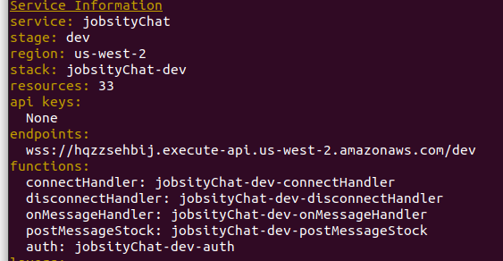

# Jobsitychat
==============================================
Chat by sockets, if you want to try it go to [Jobsitychat](https://jobsitychat-951344569535-dev.auth.us-west-2.amazoncognito.com/login?response_type=token&client_id=bnhbtkqphva0j9dbgaui5mqhi&redirect_uri=https://jobsitychat-951344569535-dev.s3-us-west-2.amazonaws.com/index.html)
### Prerequisites
  - Git [(Installation)](https://git-scm.com/book/en/v2/Getting-Started-Installing-Git), [(SSH config)](https://support.atlassian.com/bitbucket-cloud/docs/set-up-an-ssh-key/)
  - Docker [(Installation)](https://docs.docker.com/engine/install/) [(Linux-postinstall)](https://docs.docker.com/engine/install/linux-postinstall/), Docker-composer [(Installation)](https://docs.docker.com/compose/install/)
  - AWS-CLI [(Installation)](https://docs.aws.amazon.com/cli/latest/userguide/cli-chap-install.html) (only if you want to deploy to AWS)

# Installation
Install dynamodb by docker, the docker-compose file is set to load a default database
```sh
docker-compose up
```
Install python dependencies
```sh
cd server
virtualenv --python=python3 venv
source venv/bin/activate
pip install -e .
```
# Run Test
Remember to be inside ./server
```sh
pytest jobsitychat/test/
```
Coverage, Current testing coverage 100%
```sh
$ docker-compose stop
```
Linter, Current linter coverage 100%
```sh
pylint jobsitychat/
```
# Technical information
* A serverless architecture was chosen for the optimization of resources, costs and ensuring high availability.
* You can see all the architecture configuration in the file server/serverless.yml
* Dynamodb was chosen for the high performance to store the data types of a chat
* For the authentication control, cognito was used, due to the high security standards
##### Cloud computing arquitecture with serverless
* 
##### Authorizer architecture
* 
##### Code architecture
clean architecture
* 
# Features
* All mandatory features are developed
* You can register, log in and recover password
* The bot is fault tolerant in the event that the stock api fails, it will try 3 times, it is decoupled and each call to the bot is a unique and asynchronous instruction, it also validates if the code is incorrect
* Bonus Features are developed
# Deploy
Remember you need AWS-CLI, it is not possible to test in localhost
Install required npm packages
```sh
npm install
```
Install Serverless Framework 
```sh
npm install -g serverless@1.74.1
```
Install required Python packages
```sh
pip install -r requirements.txt -t ./lib/python
```
Install required serverless plugins
```sh
sls plugin install -n serverless-pseudo-parameters
```
Deploy to AWS
```sh
serverless deploy --stage dev
```
# Additional configuration
we do not buy a domain so we need to do few configurations
* Copy your Websocket endpoint from your console like this wss://hqzzsehbij.execute-api.us-west-2.amazonaws.com/dev
* 
* Go to Cognito User Pools https://us-west-2.console.aws.amazon.com/cognito/users/?region=us-west-2#/?_k=qaioty and copy the DNS
* 
* Go to app Client Setting make sure that Cognito User Pool is enabled, and copy the ID like XXXXXXXXXXXXXXXXX
* 
* Build your DNS log in, replace COGNITO_DNS, COGNITO_CLIENT_ID and enjoy your app
* https://COGNITO_DNS.auth.us-west-2.amazoncognito.com/login?response_type=token&client_id=COGNITO_CLIENT_ID&redirect_uri=https://COGNITO_DNS.s3-us-west-2.amazonaws.com/index.html